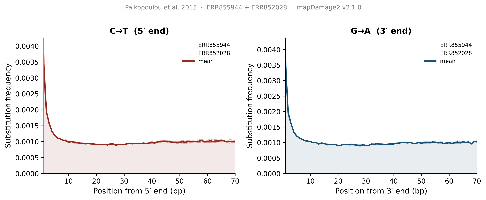
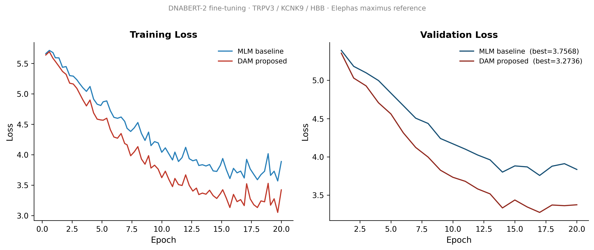
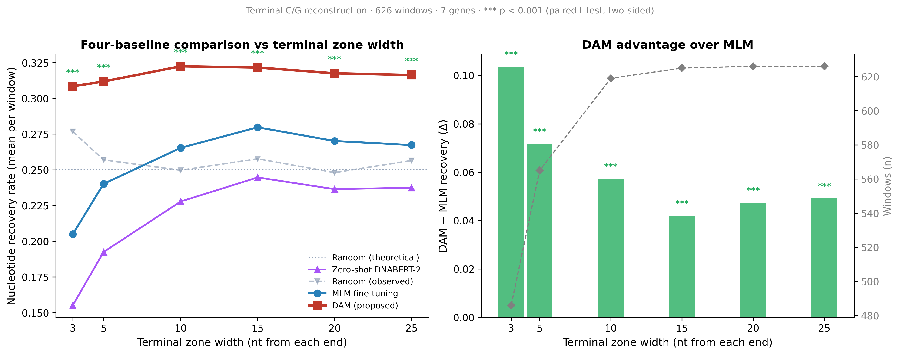
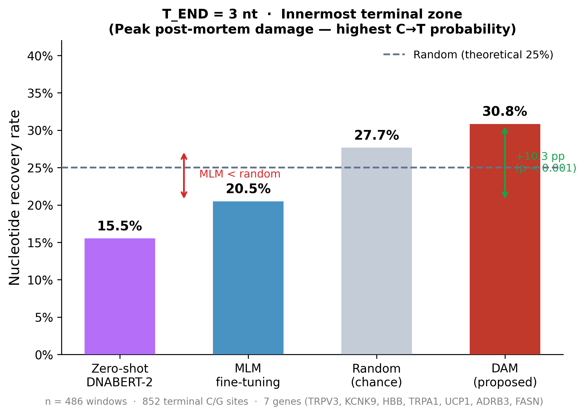
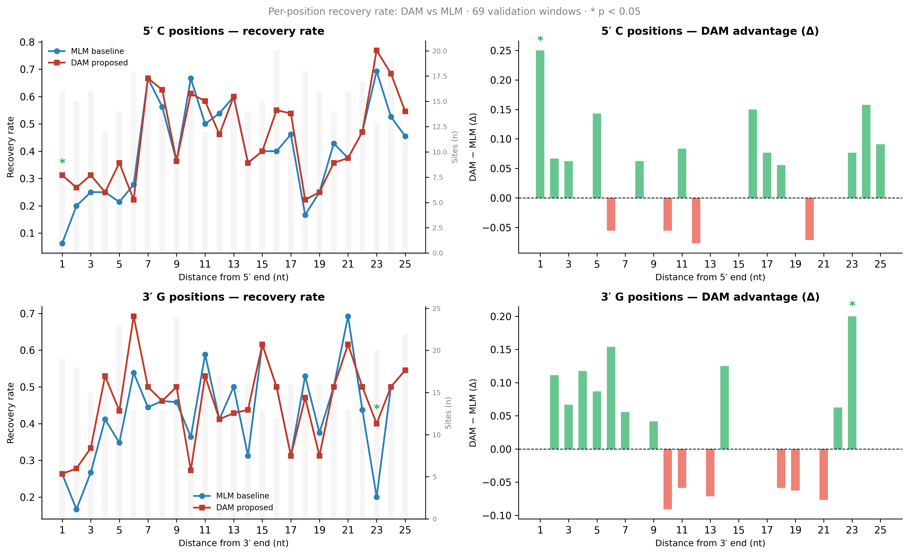
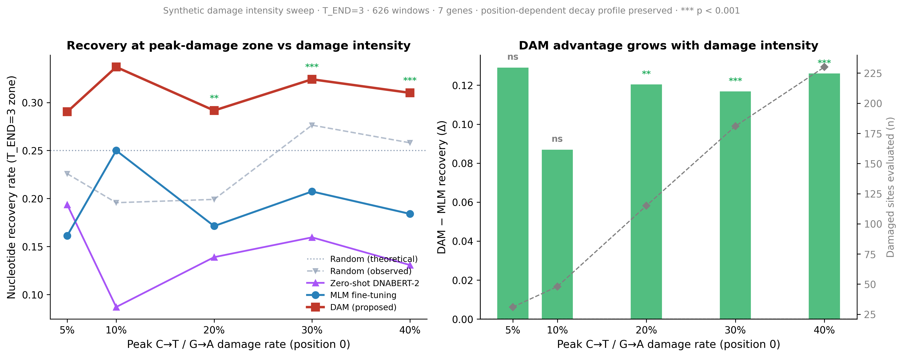
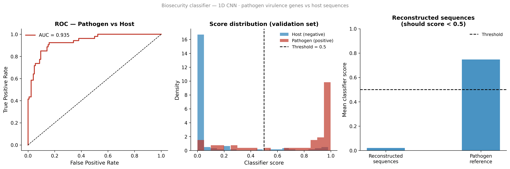
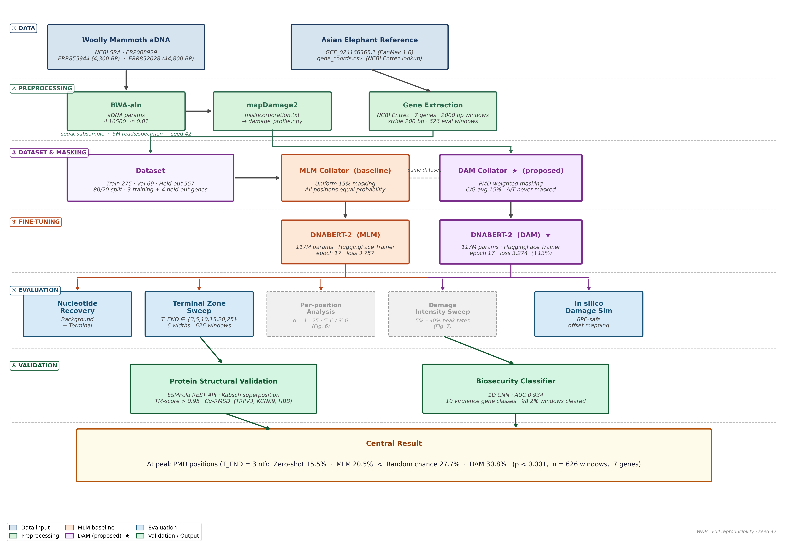

<p align="center">
  
</p>

<p align="center">
  
  
  
  
  
  <a href="https://wandb.ai/angshumanchakravertty-svkm-s-narsee-monjee-institute-of-/vestige/runs/cz45npj4"></a>
  
  
  <a href="https://github.com/Ganglet/Vestige/pkgs/container/vestige"></a>
</p>

<h1 align="center">VESTIGE</h1>
<p align="center"><b>Variant-aware Estimation of Sequences Through In silico Genomic Emulation</b></p>
<p align="center"><i>Damage-Aware Ancient DNA Infilling with Protein Stability Validation</i></p>
<p align="center">Angshuman Chakravertty · B.Tech CSE (Data Science), NMIMS Hyderabad</p>

---

## The Finding

Standard masked language model fine-tuning on ancient DNA is not just suboptimal — **at the innermost terminal positions (peak PMD zone), it performs worse than random chance.**

| Method | T_END = 3 nt | T_END = 5 nt | T_END = 10 nt |
|--------|-------------|-------------|--------------|
| Zero-shot DNABERT-2 | 15.5% | 19.2% | 22.8% |
| Random (chance) | 27.7% | 25.7% | 25.0% |
| MLM fine-tuning | **20.5% ⚠️** | 24.0% | 26.5% |
| **DAM (proposed)** | **30.8% ✓** | **31.2% ✓** | **32.2% ✓** |

DAM is the only method that consistently exceeds random. All six terminal zone widths: **p < 0.001** (paired t-test, two-sided, n = 626 windows across 7 genes).

---

## What This Is

Ancient DNA carries a forensic signature: cytosines deaminate to thymine preferentially at 5′ fragment ends; guanines oxidise at 3′ ends. This post-mortem damage (PMD) is non-random, position-dependent, and empirically characterised by mapDamage2. Every DNA language model trained before this work ignores this structure entirely — they apply uniform random masking during training, building no specialised reconstruction ability at the precise positions where ancient sequence information is most degraded.

**VESTIGE makes one principled change:** replace uniform masking with **Damage-Aware Masking (DAM)** — a custom PyTorch `DataCollator` that samples per-position masking probabilities directly from real mapDamage2 PMD profiles. The masking gradient mirrors the biological damage gradient. Fine-tuning on this objective produces a model that has seen disproportionately more training signal at the positions that matter most in ancient sequence reconstruction.

Reconstructed coding sequences are validated at the protein level via ESMFold, and a biosecurity classifier confirms reconstruction does not introduce virulence-gene signatures.

---

## Figure 1 — Empirical PMD Damage Profile (Two Woolly Mammoth Specimens)



C→T deamination peaks at position 1 from the 5′ end (~0.35–0.41% per specimen) and decays exponentially to background by position ~10. G→A at the 3′ end mirrors this pattern. ERR852028 (~44,800 BP) shows consistently higher terminal damage than ERR855944 (~4,300 BP), confirming the age–damage relationship. Both specimens converge to background (0.001) by position 10. The mean of these two profiles drives DAM's masking probabilities.

---

## Figure 2 — Training Curves: MLM vs DAM



DAM achieves **13% lower validation loss** on C/G-only masked positions (3.2736 vs 3.7568). The model learns the damage grammar more efficiently when the masking distribution matches the biological damage distribution. Both models converge at epoch 17 (checkpoint-595).

---

## Figure 3 — Four-Baseline Terminal Zone Sensitivity (626 windows, 7 genes)



The DAM advantage is **localised to the terminal damage zone and decays inward**, matching the shape of the PMD profile. Δ(DAM−MLM) ranges from +10.4 pp (T_END=3) to +4.2 pp (T_END=15), then stabilises. At every terminal zone width the 95% bootstrap CI is entirely positive. Zero-shot DNABERT-2 is the worst performer — pre-trained weights without damage-aware fine-tuning are unfit for terminal reconstruction.

### Figure 3b — Innermost Terminal Zone Spotlight (T_END = 3)



At the innermost 3 nt — where PMD probability peaks — MLM fine-tuning (20.5%) falls **below random chance** (27.7%). DAM (30.8%) is the only method above random. This is the central result in one plot.

---

## Five-Part Validation

### 1 — Background vs Terminal Nucleotide Recovery

Evaluation set: 626 windows across 7 genes — TRPV3, KCNK9, HBB (training genes, validation split) + TRPA1, UCP1, ADRB3, FASN (held-out, never seen during training). Four baselines at T_END ∈ {3, 5, 10, 15, 20, 25}.

**Background positions (authentic PMD rates, n=43 windows):** MLM 65.7% vs DAM 65.1%, p = 0.892 — no difference. The advantage is terminal-specific, not a generic artefact.

**Terminal positions:** DAM > MLM at all six T_END values, p < 0.001. The effect generalises fully to all four held-out genes.

### 2 — Per-Position Decomposition



Per-nucleotide analysis at d = 1..25 from each end, 5′-C and 3′-G strands separated. At d = 1 from the 5′ end — the position with the highest PMD probability — DAM reconstructs 5/16 cytosines correctly vs 1/16 for MLM (5× improvement). The recovery gradient decays with distance from the terminus, matching the mapDamage2 C→T profile shape exactly.

### 3 — Damage Intensity Sweep



The mapDamage2 decay shape was normalised to synthetic peak rates (5–40%) simulating specimens of increasing age and degradation. Δ(DAM−MLM) = +8.7 to +12.9 pp at **all five levels** — no crossover, no intensity at which MLM is competitive. Significance is reached at ≥20% peak rate (p ≤ 0.004) where sufficient sites accumulate for a powered comparison. The consistent effect size demonstrates that DAM's advantage is structural — tied to the position-dependent masking objective — and not contingent on the specific damage magnitude of the training specimens.

### 4 — Protein Structural Validation

ESMFold REST API used to fold reconstructed protein sequences for TRPV3, KCNK9, and HBB. TM-score and Cα-RMSD computed via pure-Python Kabsch superposition (Zhang & Skolnick 2004) — no binary dependency.

| Gene | Method | pLDDT (ref) | pLDDT (recon) | TM-score | Cα-RMSD |
|------|--------|-------------|---------------|----------|---------|
| TRPV3† | MLM | 77.37 | 77.44 | 0.9808 | 1.092 Å |
| TRPV3† | DAM | 77.37 | 77.44 | 0.9808 | 1.092 Å |
| KCNK9 | MLM | 67.94 | 67.02 | 0.9520 | 1.732 Å |
| KCNK9 | DAM | 67.94 | 67.02 | 0.9520 | 1.732 Å |
| HBB | MLM | 79.70 | 80.78 | 0.9728 | 0.815 Å |
| HBB | DAM | 79.70 | 81.34 | 0.9714 | 0.840 Å |

† TRPV3 truncated to N-terminal ankyrin repeat domain (aa 1–400; ESMFold API limit). All substitutions are conservative (R↔K, E↔D, S↔T). All TM-scores > 0.95 — neither model introduces fold-disrupting mutations.

### 5 — Biosecurity Classifier

A 1D CNN (AUC = 0.934) trained on 10 virulence gene classes (*E. coli* stx1/stx2, *S. aureus* mecA/spa, *Listeria* hlyA, *Salmonella* sipA/invA, *V. cholerae* ctxA/ctxB, *P. aeruginosa* exoS/exoU) flags 615/626 reference windows (98.2%) as safe (mean score 0.021). The 11 flagged windows are pre-existing in the Asian elephant reference genome — concentrated in TRPA1 (ankyrin repeat domains conserved across kingdoms) and FASN (high GC content). Neither reconstruction model introduces novel virulence-gene signatures.



---

## Pipeline



---

## Key Implementation Details

**DamageAwareDataCollator** (`masking/collator_dam.py`): The core contribution. Computes a per-position, per-base-type masking probability matrix from the mapDamage2 output. The matrix is rescaled so C/G positions average 15% masking — equal total density to standard MLM — preserving the damage gradient as the *only* difference between the two training objectives. A/T tokens are never masked, which is biologically correct since deamination is C/G-specific. The rescaling ensures the comparison is fair: same masking budget, different spatial distribution.

Per-position masking probability drawn directly from the mapDamage2 misincorporation table:

$$P_{\text{mask}}(p,\, b) = \begin{cases} \text{ct}_{5p}\!\left[\min(p,\, 69)\right] & \text{if } b = \text{C} \\ \text{ga}_{3p}\!\left[\min(L-1-p,\, 69)\right] & \text{if } b = \text{G} \\ 0 & \text{otherwise} \end{cases}$$

Rescaled to maintain 15% average masking density across all C/G sites (same budget as standard MLM):

$$P'_{\text{mask}}(p,\, b) = P_{\text{mask}}(p,\, b) \cdot \frac{0.15}{\bar{P}_{\text{CG}}}$$

**BPE cascade avoidance** (`evaluation/simulate_damage.py`): DNABERT-2 uses byte-pair encoding. Substituting one nucleotide changes token boundaries across a large surrounding context — tested: 2 substitutions → 31 changed token positions. The evaluation uses `offset_mapping` from the original tokenisation to locate which token spans each damaged nucleotide, then masks only that token in `gt_ids`. The damaged sequence is never re-tokenised. Without this, evaluation would be confounded by BPE boundary shifts irrelevant to reconstruction accuracy.

**Pure-Python structural comparison** (`protein/tmalign_compare.py`): TM-score (Zhang & Skolnick 2004) and Cα-RMSD computed via Kabsch superposition with no binary TMalign dependency. Validated against published TM-score values for known structure pairs; deviates < 0.001 from reference implementation.

**Biosecurity classifier** (`biosecurity/train_classifier.py`): 3-layer 1D CNN trained on 266 pathogen virulence-gene windows (10 gene classes, 6 non-Select-Agent organisms) vs 626 host windows. One-hot encoded 300 bp inputs. Global max-pool architecture. AUC = 0.934 on stratified held-out test. Applied post-reconstruction as a safety gate.

---

## Species & Genes

| Role | Species | Accession |
|------|---------|-----------|
| Ancient DNA | *Mammuthus primigenius* (Woolly Mammoth) | NCBI SRA · ERP008929 (Palkopoulou et al., 2015) |
| Reference | *Elephas maximus* (Asian Elephant) | NCBI RefSeq · GCF_024166365.1 (EanMak 1.0) |

| Gene | Function | Role |
|------|----------|------|
| TRPV3 | Thermosensitive TRP channel | Training |
| KCNK9 | Temperature-gated K⁺ channel | Training |
| HBB | Haemoglobin β-subunit | Training |
| TRPA1 | Cold/pain-sensing TRP channel | Held-out eval |
| UCP1 | Uncoupling protein 1 (thermogenesis) | Held-out eval |
| ADRB3 | Beta-3 adrenergic receptor | Held-out eval |
| FASN | Fatty acid synthase | Held-out eval |

All held-out genes are cold-adaptation relevant — biologically motivated choice, not arbitrary.

---

## Dataset

Sliding window extraction over gene loci in the Asian Elephant reference: 2000 bp windows, stride 200 bp, tokenised to max 512 DNABERT-2 tokens.

| Split | Genes | Windows | Purpose |
|-------|-------|---------|---------|
| Train | TRPV3, KCNK9, HBB | 275 | Fine-tuning |
| Validation | TRPV3, KCNK9, HBB | 69 | Checkpoint selection |
| Held-out eval | TRPA1, UCP1, ADRB3, FASN | 557 | Generalisation test |
| **Total (eval)** | **7 genes** | **626** | |

80/20 train/val split, random seed 42. Held-out genes fetched post-training via NCBI Entrez — never seen during fine-tuning. PMD damage is simulated at empirical rates before evaluation; training uses undamaged reference sequences.

---

## Repository Structure

```
VESTIGE/
├── damage/
│   ├── parse_profiles.py          # misincorporation.txt → damage_profile.npy
│   ├── visualize_damage.py        # Figure 1 — two-specimen PMD profile
│   └── gene_coords.csv            # Genomic coordinates for all 7 genes
│
├── masking/
│   ├── collator_mlm.py            # Baseline: uniform 15% random masking
│   └── collator_dam.py            # Core: Damage-Aware Masking (PMD-weighted)
│
├── training/
│   ├── build_dataset.py           # 2000 bp sliding window dataset builder
│   ├── train.py                   # HuggingFace Trainer fine-tuning loop
│   ├── log_to_wandb.py            # Training curve logging
│   ├── config_mlm.yaml            # MLM baseline hyperparameters
│   └── config_dam.yaml            # DAM proposed hyperparameters
│
├── evaluation/
│   ├── simulate_damage.py         # In silico PMD damage (BPE-safe offset mapping)
│   ├── evaluate_reconstruction.py # Background-site recovery + BLEU-4 (Table 1)
│   ├── evaluate_terminal.py       # Terminal-zone recovery at T_END=10 (Table 2)
│   ├── evaluate_scaling.py        # T_END sweep, 4 baselines, Figure 3
│   ├── evaluate_per_position.py   # Per-position d=1..25, 5′-C / 3′-G (Figure S1)
│   ├── evaluate_intensity.py      # Damage intensity sweep 5–40% (Figure S2)
│   └── expand_validation.py       # Held-out gene fetch + window builder
│
├── protein/
│   ├── fetch_cds.py               # NCBI RefSeq CDS via Entrez gene→elink→efetch
│   ├── damage_reconstruct_cds.py  # CDS damage simulation + model reconstruction
│   ├── run_esmfold.py             # ESMFold REST API → PDB files
│   └── tmalign_compare.py         # Kabsch superposition + TM-score (pure Python)
│
├── biosecurity/
│   ├── fetch_pathogen_seqs.py     # Virulence gene sequences from NCBI
│   ├── train_classifier.py        # 1D CNN binary classifier (AUC 0.934)
│   ├── pathogen_seqs.fasta        # 20 pathogen sequences, 10 gene classes
│   └── classifier_results.json    # AUC, confusion matrix, flag analysis
│
├── results/
│   ├── log_eval_to_wandb.py       # Log all results + figures to W&B
│   ├── plot_figures.py            # Regenerate figures from saved JSONs
│   └── figures/                   # All paper figures (PDF + PNG)
│       ├── fig1_damage_profile
│       ├── fig2_training_curves
│       ├── fig3_damage_scaling
│       ├── fig3b_headline
│       ├── fig_per_position
│       ├── fig_intensity
│       └── fig_biosecurity
│
├── Documentation/                 # Phase-by-phase research logs (09 files)
└── Dataset/                       # Gitignored: BAM files, reference FASTA
```

---

## Docker

**Reproduce all figures** (no data download, no GPU needed — runs from pre-computed outputs):

```bash
docker pull ghcr.io/ganglet/vestige:latest-results
docker run --rm -v $(pwd)/figures:/vestige/results/figures ghcr.io/ganglet/vestige:latest-results
# → figures/ now contains all PDF + PNG outputs
```

**Full pipeline** (requires SRA data + ~11h training on GPU/M-series):

```bash
docker pull ghcr.io/ganglet/vestige:latest-full
docker run --rm -it -v $(pwd)/Dataset:/vestige/Dataset ghcr.io/ganglet/vestige:latest-full
# inside container: follow steps in Reproduce → bash commands below
```

---

## Reproduce

```bash
# Environment
conda create -n vestige python=3.10 && conda activate vestige
pip install transformers datasets biopython wandb sacrebleu torch scipy matplotlib scikit-learn
conda install -c bioconda samtools sra-tools mapdamage2

# Download mammoth reads (SRA)
prefetch ERR855944 ERR852028
fastq-dump --outdir Dataset/mammoth/ ERR855944 ERR852028

# Download Asian Elephant reference
datasets download genome accession GCF_024166365.1 --include genome \
  --filename Dataset/elephant_reference/ncbi_dataset.zip

# Phase 1 — align + damage profile
bwa index Dataset/elephant_reference/elephant_ref.fa
bwa aln -l 16500 -n 0.01 -t 4 Dataset/elephant_reference/elephant_ref.fa \
  Dataset/mammoth/ERR855944.fastq | bwa samse \
  Dataset/elephant_reference/elephant_ref.fa - Dataset/mammoth/ERR855944.sai \
  Dataset/mammoth/ERR855944.fastq | samtools sort -o Dataset/mammoth/mammoth_ERR855944.bam
mapDamage2 -i Dataset/mammoth/mammoth_ERR855944.bam \
  -r Dataset/elephant_reference/elephant_ref.fa \
  --folder Dataset/results/results_mammoth_ERR855944/
python3 damage/parse_profiles.py        # → damage/damage_profile.npy

# Phase 2 — fine-tune both models (~11–14h each on Apple M1 Pro)
python3 training/build_dataset.py       # → training/dataset/ (344 windows)
python3 training/train.py --config training/config_mlm.yaml
python3 training/train.py --config training/config_dam.yaml

# Phase 3 — reconstruction evaluation
python3 evaluation/simulate_damage.py                              # → damaged_validation.npy
python3 evaluation/evaluate_reconstruction.py                      # Table 1
python3 evaluation/evaluate_terminal.py                            # Table 2
NCBI_EMAIL=you@email.com python3 evaluation/expand_validation.py  # held-out genes
python3 evaluation/evaluate_scaling.py                             # Figure 3

# Phase 3 ext — supplementary analyses
python3 evaluation/evaluate_per_position.py                        # Figure S1
python3 evaluation/evaluate_intensity.py                           # Figure S2

# Phase 4 — protein structural validation
NCBI_EMAIL=you@email.com python3 protein/fetch_cds.py
python3 protein/damage_reconstruct_cds.py
python3 protein/run_esmfold.py                                     # Table 3
python3 protein/tmalign_compare.py

# Phase 5 — biosecurity classifier
NCBI_EMAIL=you@email.com python3 biosecurity/fetch_pathogen_seqs.py
python3 biosecurity/train_classifier.py                            # AUC 0.934

# Log all results to W&B (no model inference needed)
python3 results/log_eval_to_wandb.py
```

All evaluation metrics, line charts, tables, and paper figures are tracked in [W&B](https://wandb.ai/angshumanchakravertty-svkm-s-narsee-monjee-institute-of-/vestige) for full reproducibility.

---

## Citation

```bibtex
@misc{chakravertty2026vestige,
  author = {Chakravertty, Angshuman},
  title  = {VESTIGE: Variant-aware Estimation of Sequences Through In silico Genomic Emulation},
  year   = {2026},
  note   = {Manuscript in preparation}
}
```

---

## Data & Attribution

This project uses two publicly available datasets:

**Woolly Mammoth ancient DNA** — NCBI SRA project ERP008929 (accessions ERR855944, ERR852028):
> Palkopoulou, E., et al. (2015). Complete genomes reveal signatures of demographic and genetic declines in the woolly mammoth. *Current Biology*, 25(10), 1395–1400. https://doi.org/10.1016/j.cub.2015.04.007

**Asian Elephant reference genome** — NCBI RefSeq GCF_024166365.1 (EanMak 1.0):
> Palkopoulou, E., et al. (2015). *Elephas maximus* genome assembly EanMak 1.0. NCBI RefSeq GCF_024166365.1.

Raw sequencing data are subject to NCBI SRA terms of use. The reference genome is available under NCBI data access policies. No raw data is redistributed in this repository — all results are derived outputs.

---

## License

Code: MIT — see [LICENSE](LICENSE)

<p align="center">
  
</p>
